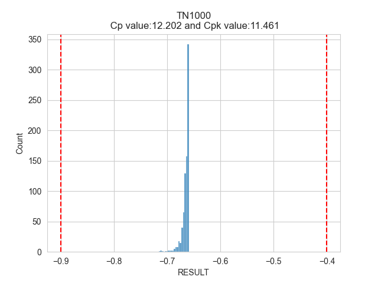

# Notes

This folder contains module to work with stdf (Standard Test Data Format) and analysis method
- [ ] is it possible to determine product failure mode depending on fail test items, as Machine Learning method ??

## 20250111
* use exist module on pystdf and modified to capture "PTR (Parametric Test Record)" items
* drop redundant columns in DataFrame
* plot certain test item with Seaborn

## 20250113
* define Cp and Cpk function to check on test item
* add limit axis into plot and save as png

