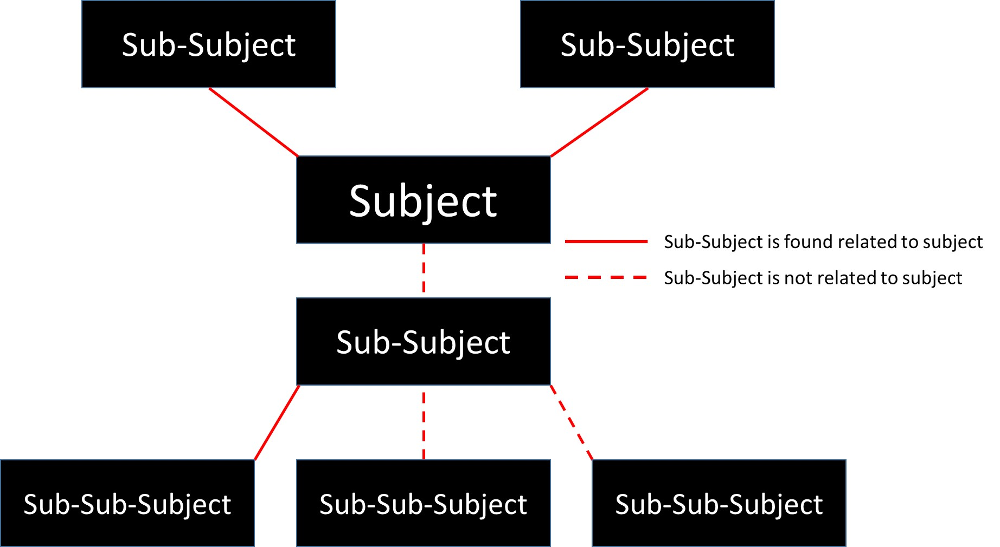

# Purpose
the purpose is to find the subject related to core question or topic

## 20250131
* check the links regarding to topic in wikipedia, and if there is keyword same as topic then it's strong connect
- [X] create a function including diverse and depth, which diverse is how many links regarding to topic and depth is how many sub items need to be checked : by using pytube and wikipedia python module, it can show recommend video.
- [X] based on the diverse and depth, then search on the top recommend video for infomation : by using pytube and wikipedia python module, it can show recommend video.

##20250202
* the structue is built with pytube and wikipedia module. First it capture related subject related to keyword, then use the subject and search on youtube following with related video
